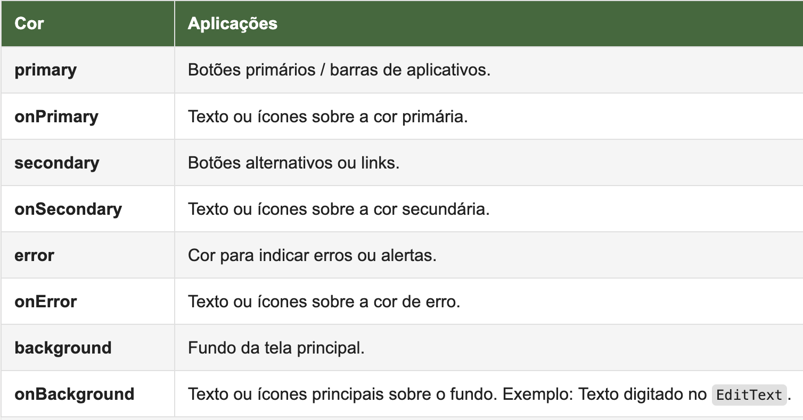

//caminho padrão para imagens

:figure-caption: Figura
:doctype: book

//gera apresentacao
//pode se baixar os arquivos e add no diretório
:revealjsdir: https://cdnjs.cloudflare.com/ajax/libs/reveal.js/3.8.0

//GERAR ARQUIVOS
//make slides
//make ebook

== Classe Context

No desenvolvimento para Android, o Contexto (Context) é um conceito fundamental que representa o estado atual do aplicativo ou de um objeto dentro dele. Trata-se de uma classe abstrata que funciona como uma interface que permite que objetos acessem informações e recursos do sistema Android, como serviços, atividades, recursos do aplicativo (como strings, layouts e imagens) e outras funcionalidades específicas da plataforma. 

Dois principais contextos usados no desenvolvimento inicial de apps:

- Application Context:
    Representa o contexto global do aplicativo, com um ciclo de vida ligado ao processo inteiro do app.
    Acessado via getApplicationContext().
    Ideal para operações que não dependem de uma interface de usuário, como acessar SharedPreferences, strings, imagens, temas.

- Activity Context:
    Vinculado a uma Activity específica, com ciclo de vida associado a ela.
    Acessado diretamente com this dentro de uma Activity.
    Usado para operações relacionadas à interface do usuário, como inflar layouts, exibir dialogs ou gerenciar views.
    Exemplo de uso: Carregar um layout com LayoutInflater.from(this) ou exibir um Toast.

As classes Application, Activity e Service são implementações da classe abstrata Context.

- Referência: STACK OVER FLOW. O que é um context no Android. Disponível em: https://pt.stackoverflow.com/questions/38853/o-que-%C3%A9-um-context-no-android. Pergunta realizada pelo usuário <https://pt.stackoverflow.com/users/6699/felipe-rce> e respondida pelo usuário <https://pt.stackoverflow.com/users/357/piovezan>. 

= Linear Layout

O layout pode ser visto como uma caixa, pois nele vão estar as views como: um botão, um campo de entrada de texto, uma imagem e outras views. Existem vários tipos de layout que o SDK oferece que serão vistos em outros exemplos. O Linear Layout é o mais simples dos layouts, nele pode ser configurado dois tipos de orientações. Qual a diferença entre o Linear Layout com orientação vertical e com orientação horizontal?

A figura 1 mostra as posições dos elementos quando usa-se o linear layout com orientação verticial.

Figura 1

A figura 2 mostra as posições dos elementos quando usa-se o linear layout com orientação horizontal.

Figura 2

A figura 3 mostra um exemplo de combinação de layouts. Observe que foi possível inserir um linear layout com orientação horizontal, dentro de um linear layout com orientação vertical.

Figura 

image::combinacao_layouts.png[width=100,height=100]

Exemplos práticos (linear layout, view, activity e intent)

- MainActivity.java
[source,java]
import androidx.appcompat.app.AppCompatActivity;
import android.content.Intent;
import android.os.Bundle;
import android.view.View;
import android.widget.Button;
import android.widget.EditText;
import android.widget.TextView;
public class MainActivity extends AppCompatActivity {
    private EditText editTextPalavra;
    private Button buttonClicar;
    private TextView textViewResultado;
    @Override
    protected void onCreate(Bundle savedInstanceState) {
        super.onCreate(savedInstanceState);
        setContentView(R.layout.activity_main);
        editTextPalavra = findViewById(R.id.editTextPalavra);
        buttonClicar = findViewById(R.id.buttonClicar);
        textViewResultado = findViewById(R.id.textViewResultado);
        buttonClicar.setOnClickListener(new View.OnClickListener() {
            @Override
            public void onClick(View view) {
                String msg = editTextPalavra.getText().toString();
                textViewResultado.setText(msg);
                Intent it = new Intent(MainActivity.this,SegundaActivity.class);
                it.putExtra("dados",msg);
                startActivity(it);
            }
        });
    }//onCreate
}//class

- activity_main.xml
[source,xml]
<?xml version="1.0" encoding="utf-8"?>
<LinearLayout xmlns:android="http://schemas.android.com/apk/res/android"
    xmlns:app="http://schemas.android.com/apk/res-auto"
    xmlns:tools="http://schemas.android.com/tools"
    android:layout_width="match_parent"
    android:layout_height="match_parent"
    android:orientation="vertical"
    android:layout_margin="10dp"
    tools:context=".MainActivity">
    <EditText
        android:layout_width="match_parent"
        android:layout_height="wrap_content"
        android:padding="10dp"
        android:textSize="30dp"
        android:id="@+id/editTextPalavra"
        android:hint="Digite algo" />
    <Button
        android:layout_width="match_parent"
        android:layout_height="wrap_content"
        android:id="@+id/buttonClicar"
        android:textAppearance="@style/TextAppearance.AppCompat.Small"
        android:text="Clicar"/>
    <TextView
        android:layout_width="match_parent"
        android:layout_height="wrap_content"
        android:padding="10dp"
        android:textSize="30dp"
        android:id="@+id/textViewResultado"
        />
</LinearLayout>

- SegundaActivity.java
[source,java]
import androidx.appcompat.app.AppCompatActivity;
import android.content.Intent;
import android.os.Bundle;
import android.widget.TextView;
public class SegundaActivity extends AppCompatActivity {
    private TextView textViewResultado2;
    @Override
    protected void onCreate(Bundle savedInstanceState) {
        super.onCreate(savedInstanceState);
        setContentView(R.layout.activity_segunda);
        textViewResultado2 = findViewById(R.id.textViewResultado2);
        Intent i = getIntent();
        String palavra = i.getStringExtra("dados");
        textViewResultado2.setText(palavra);
    }//onCreate
}//class

- activity_segunda.xml
[source,xml]
<?xml version="1.0" encoding="utf-8"?>
<LinearLayout xmlns:android="http://schemas.android.com/apk/res/android"
    xmlns:app="http://schemas.android.com/apk/res-auto"
    xmlns:tools="http://schemas.android.com/tools"
    android:layout_width="match_parent"
    android:layout_height="match_parent"
    android:orientation="vertical"
    tools:context=".SegundaActivity">
    <TextView
        android:layout_width="match_parent"
        android:layout_height="wrap_content"
        android:padding="10dp"
        android:textSize="30dp"
        android:id="@+id/textViewResultado2"
        />
</LinearLayout>

== Algumas Ferramentas para Cores / Imagens / Ícones

O Material Theme Builder é a ferramenta oficial do Google para criar esquemas de cores baseados no Material Design 3, segue o link para acesso: https://m3.material.io/styles/color/system/how-the-system-works. Acesso em: 09 de jul. 2025.

A ferramenta App Icon Generator pode ser usada para criar as imagens com diferentes resoluções, segue o link: https://appicon.co/. Acesso em: 09 de jul. 2025. Depois de criar as várias versões da imagem, use o recurso Resource Manager no Android Studio para adicionar as imagens.

Para saber mais detalhes sobre os estilos e tamanhos referentes ao texto, acesse o material disponibilizado pela Google, Material Design. Disponível em: https://material.io/develop/android/theming/typography.

== Exemplo prático

- activity_main.xml
[source,xml]
<?xml version="1.0" encoding="utf-8"?>
<LinearLayout xmlns:android="http://schemas.android.com/apk/res/android"
    xmlns:app="http://schemas.android.com/apk/res-auto"
    xmlns:tools="http://schemas.android.com/tools"
    android:layout_width="match_parent"
    android:layout_height="match_parent"
    android:orientation="vertical"
    android:padding="16dp"
    android:background="@color/background">
    <EditText
        android:id="@+id/editTextName"
        android:layout_width="match_parent"
        android:layout_height="wrap_content"
        android:hint="Enter your name"
        android:background="@color/surface"
        android:padding="12dp"
        android:textColor="@color/onSurface"
        android:textColorHint="@color/onSurface" />
    <Button
        android:id="@+id/buttonSubmit"
        android:layout_width="wrap_content"
        android:layout_height="wrap_content"
        android:layout_gravity="center"
        android:layout_marginTop="16dp"
        android:text="Submit"
        android:backgroundTint="@color/primary"
        android:textColor="@color/onPrimary" />
    <Button
        android:id="@+id/buttonCancel"
        android:layout_width="wrap_content"
        android:layout_height="wrap_content"
        android:layout_gravity="center"
        android:layout_marginTop="8dp"
        android:text="Cancel"
        android:backgroundTint="@color/secondary"
        android:textColor="@color/onSecondary" />
    <Button
        android:id="@+id/buttonExplore"
        android:layout_width="wrap_content"
        android:layout_height="wrap_content"
        android:layout_gravity="center"
        android:layout_marginTop="8dp"
        android:text="Explore"
        android:backgroundTint="@color/tertiary"
        android:textColor="@color/onTertiary" />
    <androidx.constraintlayout.widget.ConstraintLayout
        android:layout_width="match_parent"
        android:layout_height="match_parent">
        <ImageView
            android:id="@+id/imageView2"
            android:layout_width="wrap_content"
            android:layout_height="wrap_content"
            app:layout_constraintBottom_toBottomOf="parent"
            app:layout_constraintEnd_toEndOf="parent"
            app:layout_constraintStart_toStartOf="parent"
            app:layout_constraintTop_toTopOf="parent"
            app:srcCompat="@drawable/logo_ifto_512" />
    </androidx.constraintlayout.widget.ConstraintLayout>
</LinearLayout>

- MainActivity.java
[source,java]
import android.os.Bundle;
import android.view.View;
import android.widget.Button;
import android.widget.EditText;
import android.widget.Toast;
import androidx.appcompat.app.AppCompatActivity;
public class MainActivity extends AppCompatActivity {
    @Override
    protected void onCreate(Bundle savedInstanceState) {
        super.onCreate(savedInstanceState);
        setContentView(R.layout.activity_main);
        EditText editTextName = findViewById(R.id.editTextName);
        Button buttonClick = findViewById(R.id.buttonSubmit);
        buttonClick.setOnClickListener(new View.OnClickListener() {
            @Override
            public void onClick(View v) {
                String name = editTextName.getText().toString();
                if (name.isEmpty()) {
                    Toast.makeText(MainActivity.this, "Please enter a name", Toast.LENGTH_SHORT).show();
                } else {
                    String message = "Hello World, " + name + "!";
                    Toast.makeText(MainActivity.this, message, Toast.LENGTH_LONG).show();
                }
            }
        });
    }
}

- colors.xml
[source,xml]
<?xml version="1.0" encoding="utf-8"?>
<resources>
    <color name="primary">#3c6939</color>
    <color name="onPrimary">#FFFFFF</color>
    <color name="secondary">#53634f</color>
    <color name="onSecondary">#FFFFFF</color>
    <color name="tertiary">#006970</color>
    <color name="onTertiary">#FFFFFF</color>
    <color name="error">#904a43</color>
    <color name="onError">#FFFFFF</color>
    <color name="background">#f5f5f5</color>
    <color name="onBackground">#212121</color>
    <color name="surface">#FFFFFF</color>
    <color name="onSurface">#212121</color>
</resources>

OBS: acrescentar no projeto:

     - adicionar as imagens depois de gerá-las no App Icon Generator no projeto;

     - criar um novo ícone através do Image Asset;

     - alterar os atributos android:icon="@mipmap/ic_ifto" e android:roundIcon="@mipmap/ic_ifto_round" no arquivo AndroidManifest.xml.

Cores definidas no arquivo colors.xml com base no Material Theme Builder

           
          
       
   
